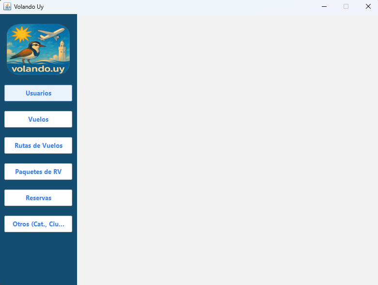

# 🚀 VolandoUY Central Server –

Este módulo es el **corazón backend** del ecosistema VolandoUY. Está basado en **Clean Architecture**, con capas desacopladas, interfaz Swing embebida y adaptadores SOAP listos para interoperabilidad, aplicando principios **SOLID**.

---

## 📦 ¿Qué hace este módulo?

* 🧠 Core de negocio del sistema VolandoUY
* 🖥️ Admin local vía Swing
* 🔌 Exposición de endpoints SOAP
* 🧱 Infraestructura desacoplada con repositorios limpios
* ✅ Cobertura de casos de uso y tests automatizados con JUnit y Mockito, simulando la Base de Datos

---

## 📚 Documentación rápida

| Tema                                     | Archivo                                                               |
| ---------------------------------------- | --------------------------------------------------------------------- |
| 📐 Arquitectura & Capas                  | [`docs/architecture.md`](docs/architecture.md)                        |
| 📁 Carpetas del proyecto                 | [`docs/architecture.md`](docs/architecture.md#estructura-de-carpetas) |
| 🧬 Repositorios limpios (User, Customer) | [`docs/repositories.md`](docs/repositories.md)                        |
| 🧠 Mappers y DTOs                        | [`docs/mappers.md`](docs/mappers.md)                                  |
| 🧪 Testing y casos de uso                | [`docs/usecases.md`](docs/usecases.md)                                |
| ⚙️ Cómo correr el proyecto               | [`docs/setup.md`](docs/setup.md)                                      |

> Si querés ir al grano, arrancá con [`docs/setup.md`](docs/setup.md)

---

## 🧑‍💻 Autores

* Jose Hernandez
* Nahuel Martinez
* Juan Quian
* Ignacio Suárez

---

