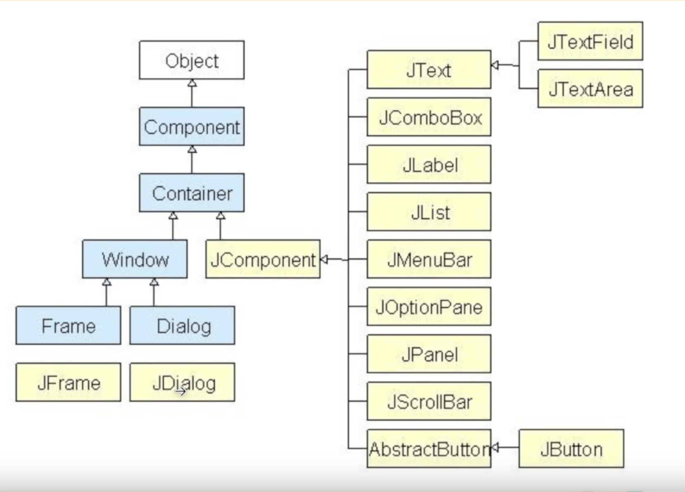

## Java

### Content

- [Content](#content)
- [1. MVC](#1-mvc-model-view-controller)
  - [1.1. Model](#11-model)
  - [1.2. View](#12-view)
  - [1.3. Controller](#13-controller)
- [2. Our View: Swing](#2-our-view-swing)

### 1. MVC (Model-View-Controller)

#### 1.1. Model
Este componente representa los datos y la lógica de negocio de la aplicación. Se encarga de gestionar los datos, recuperarlos de fuentes como bases de datos, realizar cálculos y aplicar las reglas de negocio. El modelo es independiente de la interfaz de usuario.

#### 1.2. View
La vista es la capa de presentación de la aplicación, responsable de mostrar los datos al usuario. Representa los elementos de la interfaz de usuario y visualiza la información proporcionada por el modelo. Las vistas se pueden implementar utilizando tecnologías como JavaServer Pages (JSP), Thymeleaf u otros motores de plantillas en aplicaciones web, o Swing/JavaFX para aplicaciones de escritorio.

#### 1.3. Controller
El controlador actúa como intermediario entre el modelo y la vista. Recibe la entrada del usuario desde la vista, la procesa y, a continuación, interactúa con el modelo para actualizar los datos o realizar acciones basadas en la entrada. Una vez actualizado el modelo, el controlador determina qué vista mostrar al usuario, reflejando los cambios en el modelo. En las aplicaciones web Java, los controladores se implementan a menudo utilizando servlets o marcos de trabajo como Spring MVC.

## 2. Our View: Swing

Swing es una librería que proporciona un conjunto de componentes para crear interfaces gráficas.

Vamos a estar usando esta libreria para la View de nuestra aplicación.

Arquitectura de Swing
